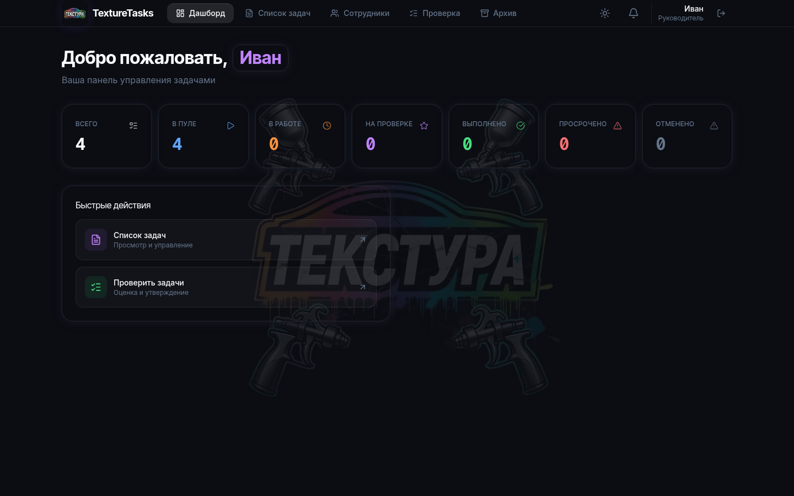
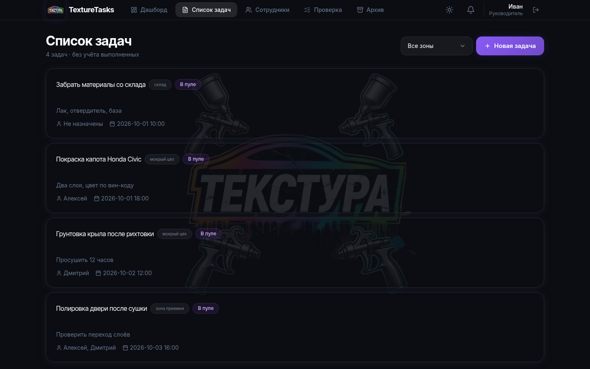
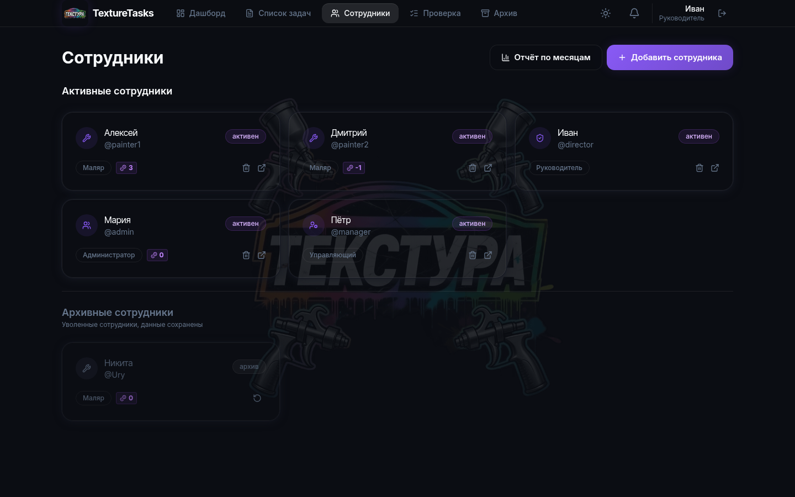
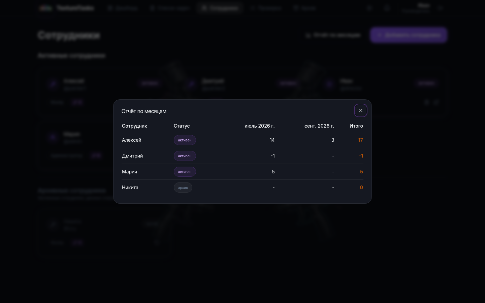
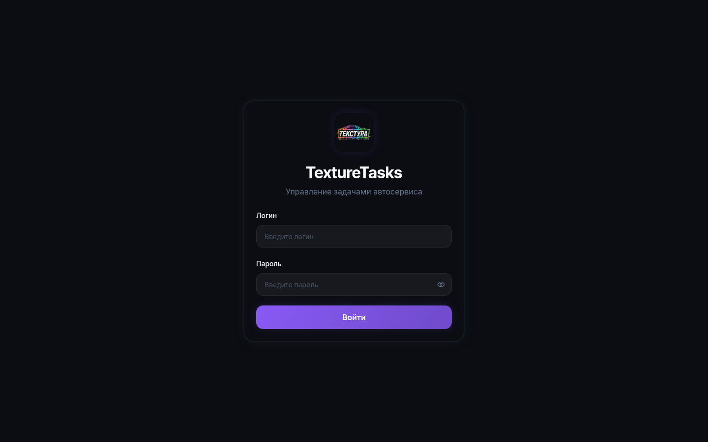

# TextureTasks

Полностраничное веб-приложение для управления задачами мастерской: недельные планы работ, контроль сроков, фотоотчёты, рейтинги сотрудников и гибкие роли с серверной проверкой прав.

## Скриншоты

**Дашборд**



**Список задач**



**Сотрудники**



**Отчёт по месяцам**



**Вход**



## Возможности

- **Роли и доступ** — `director`, `manager`, `admin`, `painter`: каждый эндпоинт проверяет роль на сервере (например, изменение задач — только руководство, маляр видит и ведёт только свои).
- **Недельные планы** — задачи группируются по неделям и «зонам» (мокрый цех, зона приёмки, склад…), с дедлайнами и ответственными.
- **Жизненный цикл задачи** — пул → в работе → на проверке → выполнено; также отмена и просрочка. Приёмка и комментарии руководителем.
- **Фотоотчёты** — загрузка изображений к задачам с проверкой MIME-типа (принимаются только настоящие изображения).
- **Рейтинги** — баллы сотрудников, автоматический сброс раз в месяц, отчёт по месяцам для руководства.
- **Уведомления** — фоновый воркер каждые 5 минут проверяет приближающиеся дедлайны и просрочки.
- **Архив** — выполненные задачи сохраняются и остаются доступными для просмотра.
- **Ежедневный бэкап БД** — фоновый воркер, `pg_dump` в production.
- **PWA и UI** — manifest + иконки, тёмная/светлая тема, адаптивный интерфейс на Radix UI + TailwindCSS.

## Стек

| Слой | Технологии |
|---|---|
| Backend | Python, FastAPI, SQLAlchemy 2 (async), Alembic, Pydantic, python-jose (JWT), passlib/bcrypt, python-magic |
| Frontend | React 18, TypeScript, Vite, TailwindCSS, Radix UI, React Router |
| База данных | PostgreSQL (production), SQLite (разработка) |
| Инфраструктура | nginx + TLS (Let's Encrypt), systemd, регулярные бэкапы `pg_dump` |

## Архитектура

- **`backend/`** — FastAPI-приложение:
  - `app/routers/` — API: `auth`, `users`, `weekly_lists`, `tasks`, `notifications`;
  - `app/services/` — аутентификация, уведомления, рейтинги, бэкапы;
  - `app/models/` — SQLAlchemy-модели, `app/schemas/` — Pydantic-схемы.
- **`frontend/`** — SPA: `src/pages/` (Дашборд, Список задач, Сотрудники, Проверка, Архив, Отчёт по месяцам), `src/api/` — типизированный API-клиент.
- **Фоновые воркеры** внутри приложения: уведомления и сброс рейтингов — каждые 5 минут, бэкап БД — раз в сутки.
- **`deploy/`** — nginx-конфиг, systemd-юнит и инструкция по деплою.
- **`SECURITY_AUDIT.md`** — полный отчёт по аудиту безопасности с разбором находок и исправлений.

## Безопасность

Основные меры (полный разбор — в [SECURITY_AUDIT.md](SECURITY_AUDIT.md)):

- JWT-сессии со сроком 12 часов, пароли — bcrypt-хеши.
- RBAC: серверная проверка роли на каждый эндпоинт, а не только в UI.
- Rate-limit на логин с корректным определением IP клиента за nginx (защита от брутфорса).
- Загрузка файлов только с проверенным MIME-типом, отдача по именам из БД (защита от XSS и path traversal).
- Security-заголовки: HSTS, CSP, `X-Frame-Options`, `nosniff` и др.
- Access-логи nginx без query string — токены не попадают в логи.
- `.env`, база данных и загруженные файлы исключены из репозитория через `.gitignore`.

## Быстрый старт

### Backend

```bash
cd backend
python3 -m venv venv && source venv/bin/activate
pip install -r requirements.txt
cp .env.example .env        # заполните SECRET_KEY
uvicorn app.main:app --reload --port 8000
```

При первом запуске создаётся аккаунт `director` со случайным паролем — он печатается в консоль при старте, сохраните его.

### Frontend

```bash
cd frontend
npm install
npm run dev
```

Приложение откроется на http://localhost:5173 — dev-сервер проксирует `/api` на бэкенд (порт 8000).

## Деплой

Готовые конфигурации в [`deploy/`](deploy/): nginx с TLS и security-заголовками, systemd-юнит для backend, пошаговая инструкция — см. [deploy/README.md](deploy/README.md).

## Структура репозитория

```
├── backend/            # FastAPI + SQLAlchemy (async)
│   ├── app/
│   │   ├── routers/    # auth, users, weekly_lists, tasks, notifications
│   │   ├── services/   # аутентификация, уведомления, рейтинги, бэкапы
│   │   ├── models/     # SQLAlchemy-модели
│   │   └── schemas/    # Pydantic-схемы
│   ├── .env.example    # шаблон конфигурации
│   └── requirements.txt
├── frontend/           # React + TypeScript + Vite + TailwindCSS
│   └── src/
│       ├── pages/      # Дашборд, Задачи, Сотрудники, Проверка, Архив…
│       └── api/        # типизированный API-клиент
├── deploy/             # nginx, systemd, инструкция деплоя
├── docs/screenshots/   # скриншоты интерфейса
└── SECURITY_AUDIT.md   # отчёт по аудиту безопасности
```
